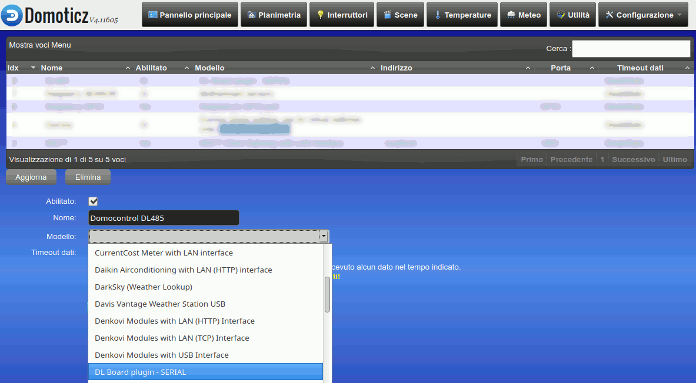
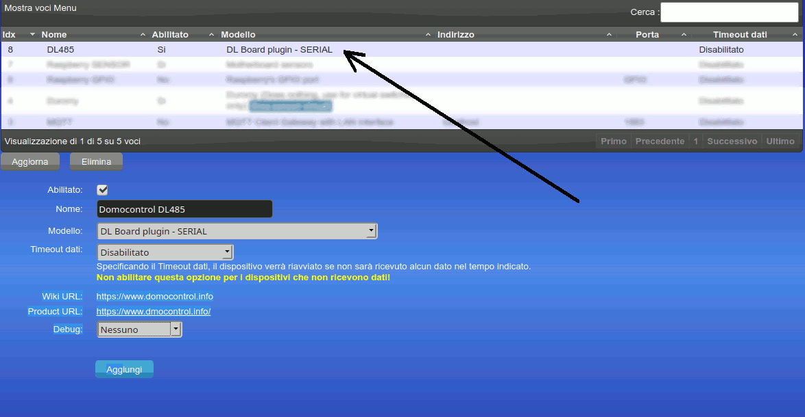

# ITALIANO

# Domocontrol DL485 - Plugin per Domoticz
Plugin in Python3 per la gestione e il controllo delle board per domotica della serie DL485

## Installazione 

1. Aggiornare e Installare i seguenti pacchetti da terminale:
```
sudo apt update
sudo apt upgrade
sudo apt install python3-dev python3-serial
```

2. Installare la libreria DL485_BUS
```
cd /home/pi/
git clone https://github.com/lucasub/DL485_BUS.git DL485_BUS
```

3. Modificare il file di configurazione config.json secondo le proprie esigenze
```
cd DL485_BUS
nano config.json
```

3. Clonare il plugin dentro l'apposita cartella Domoticz
```
cd /home/pi/domoticz/plugins
git clone https://github.com/lucasub/DL485_DOMOTICZ.git DL485_DOMOTICZ
```
4. Riavviare domoticz tramite riavvia il sistema Configurazione->Più opzioni->Riavvia il sistema
5. Dal menu "Configurazione->Hardware" selezionare il plugin "DL board plaugin" dalla tendina Modello


4. Dare un nome al plugin tramite la casella di testo "Nome"
5. Premere il tasto "Aggiungi"


6. Il Plugin creerà tutti i dispositivi come da file di configurazione config.json presente nella cartella /home/pi/DL485_BUS

## Aggiornamento Plugin

1. Andare nella cartella del plugin
```
cd /home/pi/domoticz/plugins/DL485_DOMOTICZ
git pull
```
2. Riavviare domoticz

## Informazioni

Per tutte le informazioni sulle funzionalità e configurazione delle Board DL485: https://www.domocontrol.info

---

# Domocontrol DL485 - Domoticz Python Plugin
Python3 plugin for Domoticz to add integration with dl485_domoticz project

## Installation

1. Clone repository into your domoticz plugins folder
```
cd /home/pi/domoticz/plugins
git clone https://github.com/lucasub/DL485_DOMOTICZ.git DL485_DOMOTICZ
```
2. Restart domoticz
3. Make sure that "Accept new Hardware Devices" is enabled in Domoticz settings
4. Go to "Setup->Hardware" page and add new item with type "DL Board plugin - SERIAL"
5. Press Add button

## Plugin update

1. Go to plugin folder and pull new version
```
cd /home/pi/domoticz/plugins/DL485_DOMOTICZ
git pull
```
2. Restart domoticz

## Informations

For all informations about configurations: https://www.domocontrol.info
